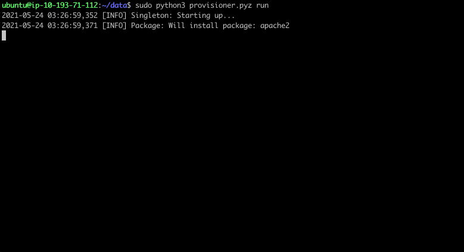

# provisioner

A simple tool for configuring Debian Linux servers, much like [Puppet](https://puppet.com), [Chef](https://www.chef.io), and [Ansible](https://www.ansible.com).



## Usage

Download the latest release of `provisioner.pyz` [from GitHub](https://github.com/nicwaller/provisioner/releases) onto your server.

Make sure you've [authored](#authoring) a `server.json` file first and placed it in the same directory.

You can run the provisioner once, or set it up as a long-lived daemon that runs periodically. If you're practicing [immutable infrastructure](https://www.hashicorp.com/resources/what-is-mutable-vs-immutable-infrastructure) then you'll probably run the provisioner once to prepare an AMI, or as a Cloud-Init process as your EC2 instance is starting up. If you have long-lived, mutable servers you'll probably want to run the provisioner in daemon mode, with the process supervisor of your choice (eg. systemd or runit). 

The provisioner must run as root user.

```shell
sudo python3 provisioner.pyz --help          # Show usage instructions
sudo python3 provisioner.pyz run             # Once
sudo python3 provisioner.pyz run --dry-run   # Once, as a dry run (no changes)
sudo python3 provisioner.pyz daemon -i 3600  # Periodically
```

Human-readable logs are written to /dev/stdout. If you're collecting log events into a central system, you'll want to enable JSON logging mode with the `LOGS="JSON"` environment variable.

Only one provisioner can run at a time; the provisioner will exit if it detects another one is already running. The pidfile is saved to `/var/run/provisioner.pid`.

## Authoring

Look at the documentation pages for [resources](doc/resources).

For the best possible authoring experience, use an editor that supports JSON schema, such as VS Code or JetBrains IDEA. Always get the JSON schema for the version you're running:

```shell
python3 provisioner.pyz schema
```

## Building

`make dist/provisioner.pyz`

This produces a self-contained Python [zipapp](https://docs.python.org/3/library/zipapp.html) that can easily be copied onto a server.

## Testing


- how to invoke configuration

where to find backups if your files get overwritten

sensitive values and keys

piping to stdin? multiple files? (build process is responsible for concatenating)


## Per-Resource documentation

Auromatically create parent directories by default? With what mode? Only traverse? Same mode as file? Secure by default, fail fast design. 


## Testing

There are a few unit tests written with Pytest. ⚠️ However, they don't work right now because of module import conflicts related to the use of zipapp.

Instead, go run integration tests with [Test Kitchen](../test-kitchen).

## compatibility

Only compatible with Debian-based Linux systems with Python 3.6 or higher. Ubuntu 18.04 and 20.04 are both confirmed working.

It does **not** work on macOS.


